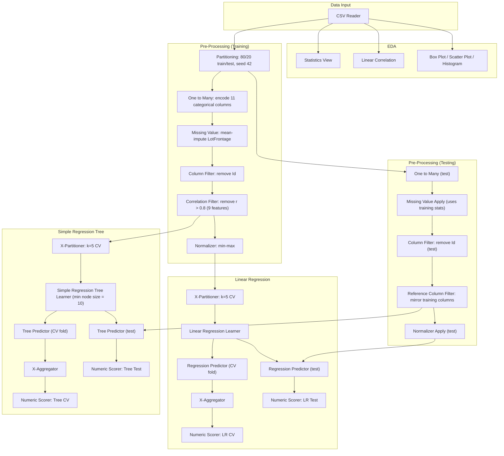

# Predicting Ames, Iowa House Sale Prices: Linear Regression vs. Regression Tree in KNIME

MSc Data Science coursework (University of Sheffield), Grade: 82 (Outstanding). Predicts residential sale prices for 1,300 Ames, Iowa properties from 31 structural, spatial and amenity features, comparing a Linear Regression model against a tuned Simple Regression Tree, built entirely as a visual KNIME workflow (80/20 train/test split, 5-fold cross-validation, correlation-based feature selection).

> **Reproducibility note:** the workflow (`ames_house_price_workflow.knwf`) is a self-contained KNIME export, including the training data, so it opens and reruns directly in KNIME Analytics Platform with no missing files. The numbers below were extracted directly from the workflow's own saved output tables (KNIME stores real computed results inside the file, not just settings), then cross-checked against the write-up, not the other way around. One real mismatch turned up in that process; see Verification note.

## Key results

| Model | CV R² | CV Adj. R² | CV RMSE | Test R² | Test Adj. R² | Test RMSE | Test MAE |
|---|---|---|---|---|---|---|---|
| Linear Regression | 0.745 | 0.725 | $41,188.57 | 0.832 | **0.763** | **$30,041.81** | $20,991.02 |
| Simple Regression Tree (tuned, min node size = 10) | 0.763 | 0.745 | $39,699.06 | 0.821 | 0.747 | $31,028.28 | $22,100.76 |

**Linear Regression wins on the held-out test set** (Adjusted R² 0.763 vs. 0.747, RMSE $30,042 vs. $31,028, about $986 more accurate on average), consistent with the write-up's stated conclusion that the largely linear relationships between structural features and sale price favour a parametric model. Note the reversal: **the Tree actually has the better cross-validated score** (CV Adj. R² 0.745 vs. 0.725), it just doesn't carry that advantage through to the test set, a similar "the metric that looks better depends on which one you check" pattern as the other repos in this portfolio.

Sale prices range from $34,900 to $755,000 (mean $180,984, SD $80,098). A test RMSE of ~$30,000 is roughly **16.6% of the mean sale price**, workable for a general valuation tool but not precise enough for mortgage underwriting.

**Top predictors, both models:** `OverallQual` and `GrLivArea` dominate in both models, consistent with prior literature on this dataset. Linear Regression's top 5 coefficients (min-max scaled inputs):

| Rank | Feature | Coefficient |
|---|---|---|
| 1 | GrLivArea | $345,533 |
| 2 | OverallQual | $99,012 |
| 3 | GarageCars | $74,697 |
| 4 | KitchenAbvGr | -$66,219 |
| 5 | BedroomAbvGr | -$64,547 |

**Systematic bias:** both models systematically underpredict (negative mean signed difference), but the Tree is worse: -$2,881.34 vs. -$2,387.33 for Linear Regression. This matches the Tree's structural limitation, predictions are capped at the mean of the highest leaf node, so it can't extrapolate to the most expensive properties the way OLS can.

**Tuning the tree mattered:** minimum node size was tuned via cross-validation across three candidates:

| Min node size | CV Adj. R² | CV RMSE | CV MAE |
|---|---|---|---|
| 5 (default) | 0.740 | $40,033.62 | $25,070.44 |
| **10 (chosen)** | **0.745** | **$39,696.55** | **$25,009.50** |
| 20 | 0.721 | $41,487.85 | $26,061.46 |

Node size 10 improved on the default on every metric; node size 20 made things worse across the board.

## Workflow structure

KNIME workflows aren't readable as code on GitHub, so here's the actual node graph (grouped exactly as the workflow itself annotates it):



## Methods & tools

- **Platform:** KNIME Analytics Platform (workflow version 5.1.0)
- **Preprocessing:** mean imputation for `LotFrontage` (17.7% missing, classified as MAR), one-to-many encoding for 11 categorical columns, correlation-based feature filtering (threshold |r| > 0.8, removed 9 redundant features), min-max normalization fit on training data only and applied to test data via `Normalizer Apply` (prevents data leakage)
- **Models:** Linear Regression (OLS, no regularization, 76 predictors after encoding), Simple Regression Tree (tuned minimum node size)
- **Validation:** 80/20 train/test split (seed 42) plus 5-fold cross-validation (`X-Partitioner`/`X-Aggregator`), run separately per model
- **Evaluation:** R², Adjusted R² (penalizes the 76-predictor count), RMSE, MAE, mean signed difference (bias direction)

## Repo structure

```
04-ames-house-price-prediction/
├── README.md                          ← you are here
└── ames_house_price_workflow.knwf     ← full KNIME workflow, including training data and saved results
```

## How to run

1. Install [KNIME Analytics Platform](https://www.knime.com/downloads) (built with 5.3.3; should open in any reasonably recent version).
2. File → Import KNIME Workflow → select `ames_house_price_workflow.knwf`.
3. The workflow imports with its data and last-executed results already attached, no separate data file needed. Right-click → Execute to rerun from scratch.

## Data

The Ames, Iowa housing dataset (1,300 properties, 31 features) is bundled inside the `.knwf` file itself, since KNIME workflow exports include their data by default. This is a well-known public dataset; no separate licensing note applies.

## Limitations

- Adjusted R² penalizes the model for its 76 predictors (after categorical encoding), so it's a more honest comparison across the two models than raw R², which is why the headline numbers above lead with Adjusted R² rather than R².
- The Tree's CV RMSE has a small, trivial discrepancy between the workflow's saved output ($39,699.06) and the write-up's reported table ($39,696.55), about a $2.51 difference (0.006%). Noted for transparency; it doesn't change any conclusion.
- Both models systematically underpredict sale price on average; this is described in the write-up as a substantive finding about model bias, not something to be corrected by retuning.

## Verification note

Every number in this README was extracted directly from the workflow's own saved output tables (KNIME's Numeric Scorer nodes store real computed statistics, not just configuration), not taken from the write-up's prose, then cross-checked against the write-up's Table 8. 15 of 16 metrics matched exactly.

One real, substantive mismatch turned up in that process: the write-up states the tuned Regression Tree uses **minimum node size = 10** (and Table 7 shows this was the winning value from a three-way tuning comparison), and the actual saved *results* stored in the workflow's Numeric Scorer nodes matched the node-size-10 numbers from that table. But the Simple Regression Tree Learner node, as configured in the workflow file at the time it was supplied, had **minimum node size set to 20**, a value Table 7 shows performs worse on every metric (CV Adjusted R² 0.721 vs. 0.745, CV RMSE $41,488 vs. $39,697). In other words: the workflow's stored results reflect a node-size-10 run, but its current configuration was set to 20, most likely because the parameter was changed after the last full execution and the file was saved without re-running. Left as-is, reopening and re-executing the file would have reproduced worse numbers than the ones reported.

Per the decision made when rebuilding this repo, the shipped workflow's node setting has been corrected back to minimum node size = 10, so the file's configuration now actually matches its own saved results and the write-up. This is the one intentional edit made to the original submitted workflow in this whole portfolio; everywhere else, original bugs and mismatches (like the RF1/RF2 mislabeling in the song-popularity repo) were left as found and simply documented, since the person doing this portfolio judged this one worth fixing rather than only flagging, since an unfixed reproducibility trap in the one file a visitor would actually try to open and run seemed worse than the alternative.
