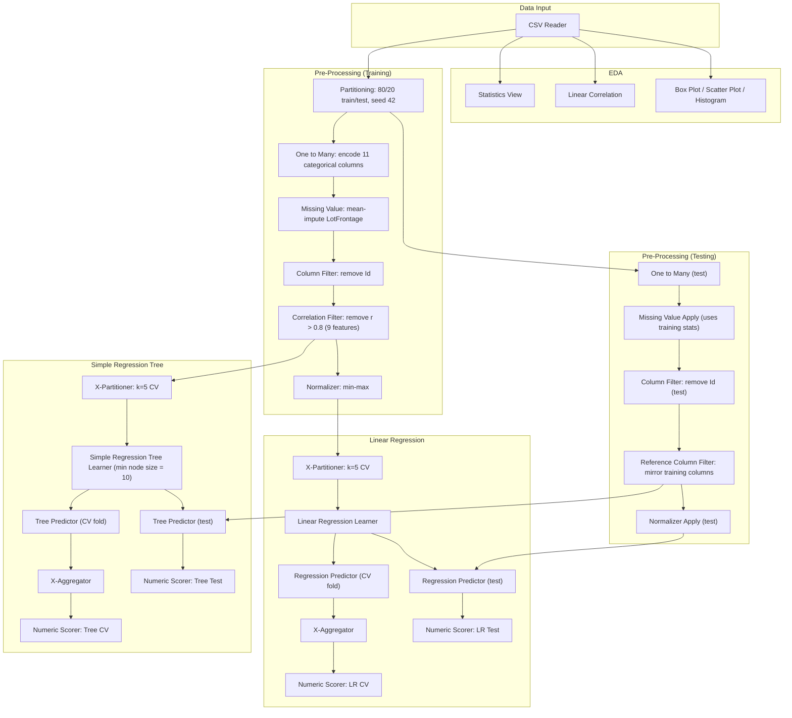

# Predicting Ames, Iowa House Sale Prices: Linear Regression vs. Regression Tree in KNIME

MSc Data Science coursework (University of Sheffield), Grade: 82 (Outstanding). Predicts residential sale prices for 1,300 Ames, Iowa properties from 31 structural, spatial and amenity features, comparing a Linear Regression model against a tuned Simple Regression Tree, built entirely as a visual KNIME workflow (80/20 train/test split, 5-fold cross-validation, correlation-based feature selection).

> **Reproducibility note:** the workflow (`ames_house_price_workflow.knwf`) is a self-contained KNIME export, including the training data, so it opens and reruns directly in KNIME Analytics Platform with no missing files. The numbers below were extracted directly from the workflow's own saved output tables (KNIME stores real computed results inside the file, not just settings), then cross-checked against my write-up, not the other way around. One real mismatch turned up in that process; see Verification note.

## Key results

| Model | CV R² | CV Adj. R² | CV RMSE | Test R² | Test Adj. R² | Test RMSE | Test MAE |
|---|---|---|---|---|---|---|---|
| Linear Regression | 0.745 | 0.725 | $41,188.57 | 0.832 | **0.763** | **$30,041.81** | $20,991.02 |
| Simple Regression Tree (tuned, min node size = 10) | 0.763 | 0.745 | $39,696.55 | 0.821 | 0.747 | $31,028.28 | $22,100.76 |

**Linear Regression wins on the held-out test set** Linear Regression scores slightly better on the held-out test set (Adjusted R² 0.763 vs. 0.747, RMSE $30,042 vs. $31,028, about $986 lower on average), while the Tree has the better cross-validated score (CV Adj. R² 0.745 vs. 0.725). The gap is narrow and comes from a single 260-property test set, so I read the two models as comparable, with the linear model favoured because the relationships between structural features and price are largely linear.

Sale prices range from $34,900 to $755,000 (mean $180,984, SD $80,098). A test RMSE of ~$30,000 is roughly **16.6% of the mean sale price**, workable for a general valuation tool but not precise enough for mortgage underwriting.

**Top predictors, both models:** `OverallQual` and `GrLivArea` dominate in both models, consistent with prior literature on this dataset. Linear Regression's top 5 coefficients (min-max scaled inputs):

| Rank | Feature | Coefficient |
|---|---|---|
| 1 | GrLivArea | $345,533 |
| 2 | OverallQual | $99,012 |
| 3 | GarageCars | $74,697 |
| 4 | KitchenAbvGr | -$66,219 |
| 5 | BedroomAbvGr | -$64,547 |

**Bias:** both models have a negative mean signed difference on the test set (Tree -$2,881.34, Linear Regression -$2,387.33). My write-up treats the Tree's underprediction as systematic: its predictions are capped at the mean of its highest leaf, which shows as banding at the top of the predicted-vs-actual plot, whereas OLS can extrapolate beyond the training range.

**Tuning gave a small improvement:** minimum node size was tuned via 5-fold cross-validation on the training set across three candidates:

| Min node size | CV Adj. R² | CV RMSE | CV MAE |
|---|---|---|---|
| 5 (default) | 0.740 | $40,033.62 | $25,070.44 |
| **10 (chosen)** | **0.745** | **$39,696.55** | **$25,009.50** |
| 20 | 0.721 | $41,487.85 | $26,061.46 |

Node size 10 improved on the default on every metric (CV Adj. R² 0.745 vs. 0.740); node size 20 made things worse.

## Workflow structure

KNIME workflows aren't readable as code on GitHub, so here's the actual node graph (grouped exactly as the workflow itself annotates it):



## Methods & tools

- **Platform:** KNIME Analytics Platform 5.3.3
- **Split:** 80/20 random train/test (seed 42): 1,040 training and 260 test properties
- **Preprocessing (fitted on training data only, then applied to the test set):** mean imputation for `LotFrontage` (17.7% missing) and mode imputation for missing text columns; dummy encoding of 11 categorical columns (85 features after encoding); `Id` removed; correlation filter (|r| > 0.8) removing 9 redundant features (3 numeric, 6 dummy), leaving 76 predictors; min-max normalisation for the Linear Regression branch only (trees are scale-invariant)
- **Models:** Linear Regression (OLS, no regularisation, 76 predictors), Simple Regression Tree (minimum node size tuned by cross-validation)
- **Validation:** 5-fold cross-validation on the training set (X-Partitioner/X-Aggregator), run separately per model, plus the held-out test set
- **Evaluation:** R², Adjusted R² (penalises the 76-predictor count), RMSE, MAE, mean signed difference (bias direction)

## Repo structure

```
ames-house-price-regression/
├── README.md                          ← you are here
└── ames_house_price_workflow.knwf     ← full KNIME workflow, including training data and saved results
```

## How to run

1. Install [KNIME Analytics Platform](https://www.knime.com/downloads) (built with 5.3.3; should open in any reasonably recent version).
2. File → Import KNIME Workflow → select `ames_house_price_workflow.knwf`.
3. The workflow imports with its data and last-executed results already attached, no separate data file needed. Right-click → Execute to rerun from scratch.

## Data

The workflow bundles the 1,300-property, 31-variable version of the Ames Housing dataset (De Cock, 2011) used in the coursework, so it reruns without a separate data file.

## Limitations

- Adjusted R² penalises the model for its 76 predictors, so it is a fairer comparison across the two models than raw R²; that is why the headline numbers lead with it.
- The Tree's CV RMSE differs by $2.51 (0.006%) between the workflow's saved output ($39,699.06) and my reported figure ($39,696.55); this does not affect any conclusion.
- Both models have a negative mean signed difference; the Tree's underprediction is the more systematic one because its predictions are capped at its highest leaf mean.
- Test-set results come from a single 20% holdout (260 properties) and the gap between the models is small, so they should be read as comparable. Linear Regression's test Adjusted R² (0.763) is higher than its cross-validated one (0.725), which reflects the variability of a single split.
- Standard errors could not be computed for most Linear Regression coefficients because of residual multicollinearity among the encoded dummy variables (the correlation filter removes pairwise but not joint collinearity), so the coefficients are useful for ranking predictors, not for inference. The large negative `KitchenAbvGr` and `BedroomAbvGr` coefficients are counterintuitive and likely reflect correlated predictors, since `GrLivArea` already captures size.
- Tree tuning covered minimum node size only (5, 10, 20); depth limits and pruning were not explored. `SalePrice` was not log-transformed, to keep RMSE and MAE in dollars.

## Verification note

Every figure in the results tables was extracted from the workflow's own saved output tables (KNIME's Numeric Scorer nodes store the computed statistics) and checked against my write-up (Tables 8, 9 and 10). All but one matched exactly; the exception is the $2.51 difference described under Limitations.

One real mismatch turned up: my write-up (Table 8) shows minimum node size = 10 was the best of three tuning candidates, and the results saved in the workflow matched that run. But the Simple Regression Tree Learner node in the submitted file was set to minimum node size = 20, which Table 8 shows performs worse (CV Adj. R² 0.721 vs. 0.745). The setting was most likely changed after the last full run and the file saved without re-running, so re-executing it would have reproduced worse numbers than reported.

I corrected that one setting back to 10 so the file matches its saved results and my write-up. It is the only change I made to the submitted workflow.
